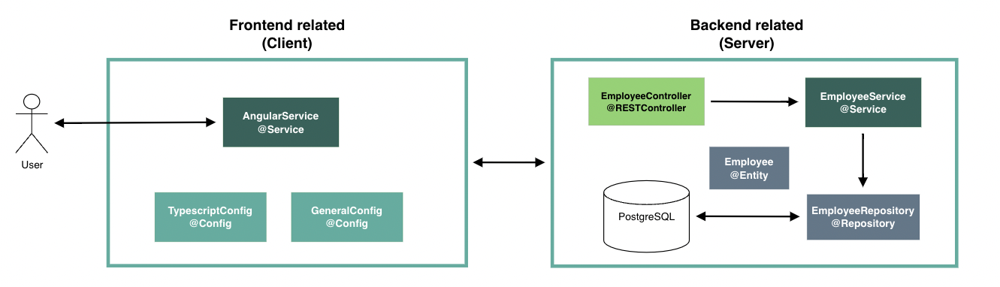
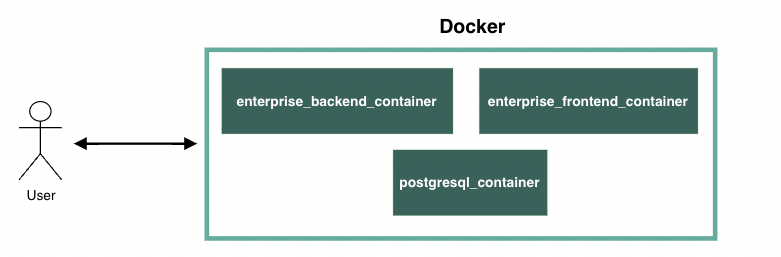

Enterprise Basic Structure
-
***
### About
This project is a basic structure proposal for a general enterprise combining both Frontend and Backend:
- [x] Spring Boot
- [ ] Spring Security with JWT authentication
- [ ] PostgreSQL for saving Employees
- [ ] REST Controllers (Employee) with open endpoints
- [ ] Logging and monitoring support
- [ ] JUnit
- [ ] API modeling (Swagger/OpenAPI) and its documentation
- [ ] Completed CI/CD circle with Circle Ci and prepared K8s config with `kompose docker-compose.yml`

To run a working copy of the code, go to [Running the project](#running-the-project).


Additionally:

- CI/CD: TBD
- K8s: TBD

***
### Architecture
This project follows the architecture shown below:



The application is wrapped with Docker which enables different containers:



_Note: Some configuration files and components have not been included into the image to ensure readability of what is more relevant._


***
### Endpoints
Enabled endpoints for user interaction:

[//]: # ()
[//]: # (| Endpoint                          | Description                              | Auth required?       |)

[//]: # (|-----------------------------------|------------------------------------------|----------------------|)

[//]: # (| `POST /api/v1/auth/register`      | Register new user                        | Does not require jwt |)

[//]: # (| `POST /api/v1/auth/authenticate`  | Authenticate user                        | Does not require jwt |)

[//]: # (| `POST /api/v1/transaction/publish`| Publish transactions to the system       | Requires jwt         |)

[//]: # (| `GET /api/v1/transaction/`        | Gets paginated list of user transactions | Requires jwt         |)

[//]: # ()
[//]: # (Once the system is up, swagger documentation is available at: `http://localhost:8080/swagger-ui/index.html#/`.)

***
### Data related

[//]: # (- PostgreSQL: To store user and their accounts.)

[//]: # (- Kafka: Used Kafka Topics and partitions to retrieve)

[//]: # ()
[//]: # (Transactions are stored in kafka topics &#40;see [Relevant implementation decisions]&#40;#Relevant-implementation-decisions&#41; for justification&#41;.)

[//]: # ()
[//]: # (The proposed solution for data management involves the creation of Kafka topics based on the year and user, following a specific schema: transactions-`year`-`clientName`. This approach ensures efficient data retrieval by dividing each topic into 12 partitions, corresponding to the months of the year.)
***
### Security related

[//]: # (Security has been implemented with Spring Security and covers the following:)

[//]: # (- User roles &#40;User, Admin&#41;.)

[//]: # (- Encrypted client passwords.)

[//]: # (- JWT for authentication within HTTP requests.)

[//]: # (- Overall HTTP security configuration &#40;endpoint whitelisting and authentication requirements for others&#41;.)

[//]: # (- Implementation of additional filters &#40;filter chain&#41; for enhanced security.)

***
### Pre-Requisites
To run this code it is necessary the following:
- Java v17
- Docker
***
### Running the project
1. Clone the repository:
```shell
gh repo clone alexpages/ebanking-api
```
2. Go to the root of the project and initialize containers with the code below:
```shell
docker-compose up
```
3. After previous step, the containers initialize and the application is ready for interaction.

The docker-compose.yml file follows a structured approach.
The Spring Boot application is encapsulated within a Docker image, which is generated during the second step of the process through the execution of a Dockerfile, being this the only image that does not get pulled from Docker Hub.

***
### Examples of requests

***
### Key Implementation Decisions

***
### Considerations for future improvements
- [ ] Enhance JwtService for token renewal.
****

